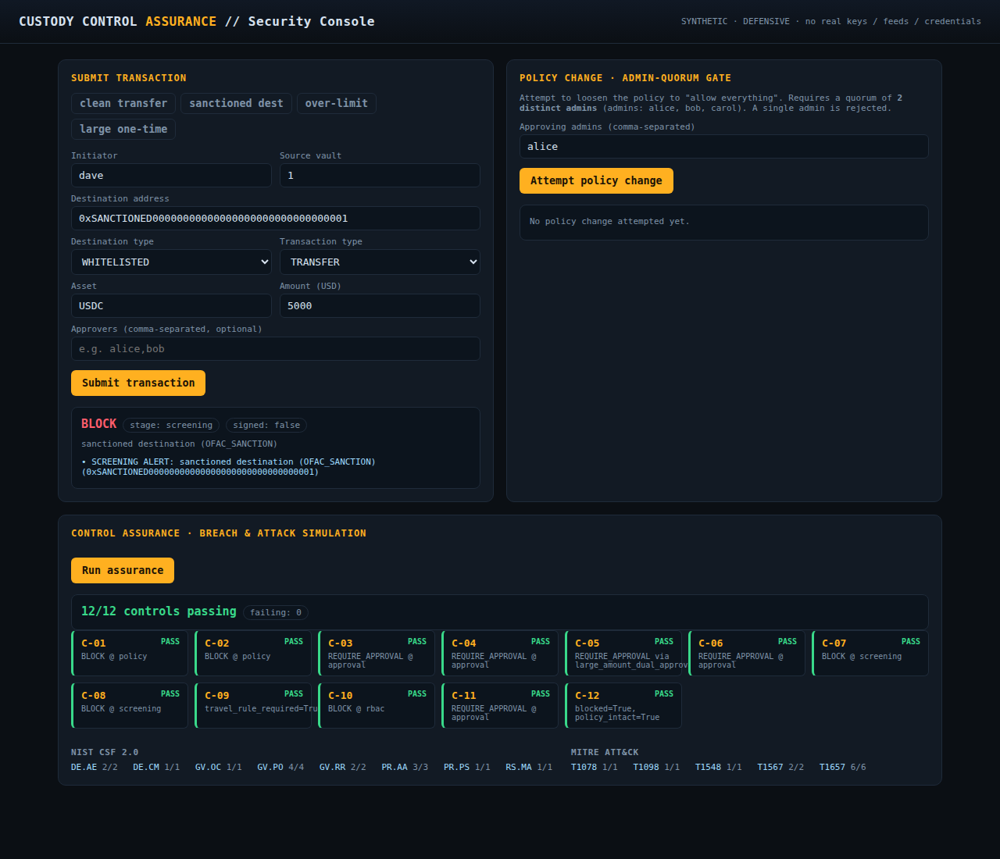
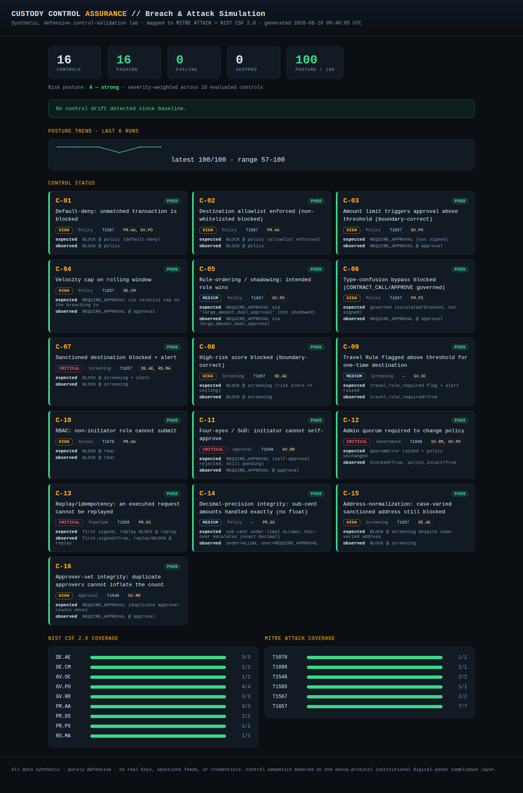
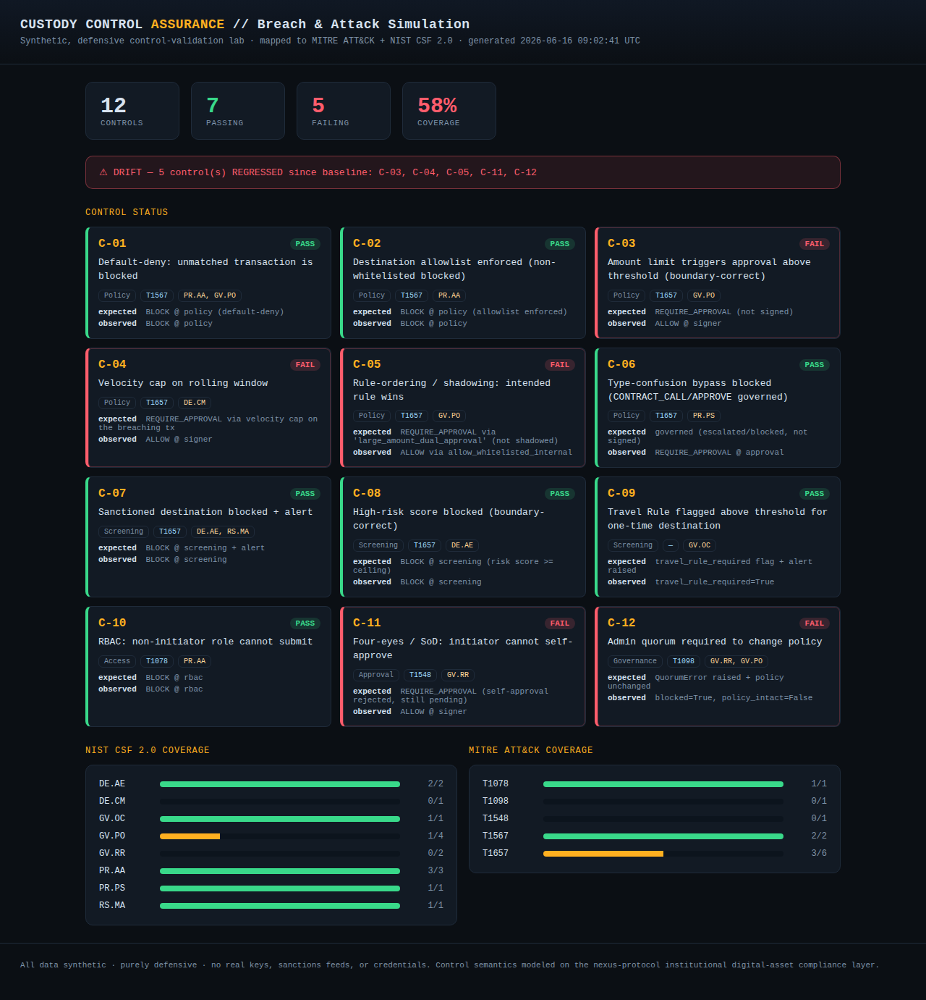
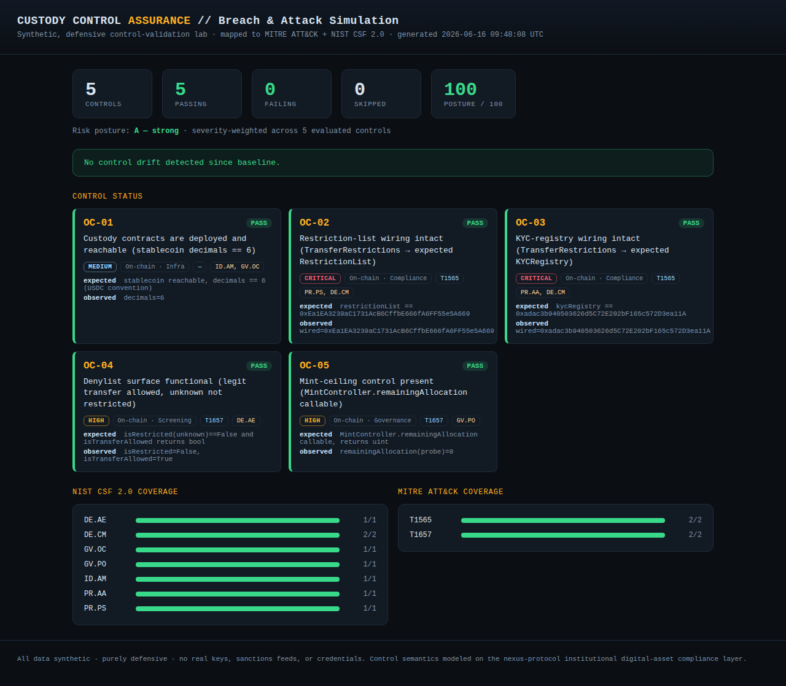

# custody-control-assurance-lab

[](https://github.com/Esoterics611/custody-control-assurance-lab/actions/workflows/ci.yml)

A **synthetic, purely defensive** Breach & Attack Simulation (BAS) lab that models the
governance stack of an institutional digital-asset **custody** platform — a Transaction
Authorization Policy (TAP) engine, pre-signing compliance screening, RBAC with
segregation-of-duties, and an admin-quorum gate on policy changes — and then
**continuously attacks those controls to prove they hold**, scoring a severity-weighted
**risk posture** and mapping coverage to **MITRE ATT&CK** and **NIST CSF 2.0**. There are
**no real keys, no real sanctions feeds, and no real exchange or API credentials** anywhere
in this repository; every simulation validates that a control **blocks, escalates, detects,
or flags** an attacker action — it never attacks a real system.

> **The differentiator:** the same harness runs against a **mock** custody platform *and*,
> read-only, against a **real deployed** institutional protocol on **Base Sepolia** — and it
> **catches a control the moment it regresses** (drift), with executive-readable evidence,
> in CI. Most candidates *talk* about validating controls; this *runs* the loop.



---

## What it does

1. **Models the custody governance stack** (`src/cal/custody/`) — the *system under test*: a
   pure TAP policy engine, compliance screening, RBAC + four-eyes, an admin-quorum governor,
   and replay protection, wired into one `submit()` pipeline.
2. **Runs 16 Breach & Attack Simulations** (`src/cal/assurance/`) — one attacker scenario per
   control objective — and asserts each control behaves correctly.
3. **Validates a real on-chain protocol** (`src/cal/onchain/`) — 5 read-only checks against
   the deployed `nexus-protocol` compliance/governance contracts on Base Sepolia, including
   **wiring-intact drift detection** (is the denylist/KYC gate still connected?).
4. **Scores risk posture & reports** — a severity-weighted posture score (0–100) + rating,
   coverage by ATT&CK technique and CSF function, **drift vs baseline**, and a **posture
   trend** — as a standalone dark HTML console, JSON, **ATT&CK Navigator layer**, **SARIF**
   (GitHub Security tab), and **JUnit**.
5. Is exercised by **pytest** (84 control/API/export tests) and **Playwright** (E2E, strict
   Page Object Model), with **GitHub Actions** CI, a **Prometheus** `/metrics` endpoint, and
   a **Docker** image.

## Architecture — the submit pipeline

Each stage is a control the assurance layer validates:

```
submit(tx) → [0 replay] → [1 RBAC] → [2 screening] → [3 TAP policy] → [4 approval/quorum] → [5 mock signer]
              dup id        authz fail   sanction→BLOCK    rule→ALLOW/        needs X-of-Y &       only if fully
              → BLOCK       → BLOCK      risk→BLOCK         BLOCK/ESCALATE     four-eyes/quorum     ALLOWed
                                         travel-rule flag
```

```
src/cal/
├── models.py            Decimal money, enums, results
├── clock.py             injectable clock — no wall-clock in business logic
├── custody/             ← SYSTEM UNDER TEST (TAP engine, screening, RBAC, quorum, pipeline)
├── assurance/           ← VALIDATION FRAMEWORK
│   ├── controls.py        registry + MITRE ATT&CK + NIST CSF 2.0 + severity
│   ├── simulations.py     16 BAS scenarios (one per control)
│   ├── runner.py          orchestrate, coverage, drift, posture score
│   ├── report.py          standalone dark HTML (grid, coverage, drift, trend)
│   ├── exports.py         ATT&CK Navigator layer · SARIF · JUnit
│   └── history.py         append-only run history (continuous monitoring)
├── onchain/             ← LIVE TARGET (read-only eth_call against Base Sepolia)
└── api/                 FastAPI + /metrics (Prometheus) · console/index.html (E2E target)
```

## The control catalog (16 mock + 5 on-chain)

| ID | Control objective | Stage | Sev | MITRE | NIST CSF 2.0 |
|----|------------------|-------|-----|-------|--------------|
| C-01 | Default-deny: unmatched tx blocked | Policy | high | T1567 | PR.AA / GV.PO |
| C-02 | Destination allowlist enforced | Policy | high | T1567 | PR.AA |
| C-03 | Amount limit → approval (boundary-correct) | Policy | high | T1657 | GV.PO |
| C-04 | Velocity cap on rolling window | Policy | high | T1657 | DE.CM |
| C-05 | Rule-ordering / shadowing: intended rule wins | Policy | medium | T1657 | GV.PO |
| C-06 | Type-confusion bypass blocked | Policy | high | T1657 | PR.PS |
| C-07 | Sanctioned destination blocked + alert | Screening | **critical** | T1657 | DE.AE / RS.MA |
| C-08 | High-risk score blocked (boundary-correct) | Screening | high | T1657 | DE.AE |
| C-09 | Travel Rule flagged above threshold | Screening | medium | — | GV.OC |
| C-10 | RBAC: non-initiator cannot submit | Access | high | T1078 | PR.AA |
| C-11 | Four-eyes: initiator cannot self-approve | Approval | **critical** | T1548 | GV.RR |
| C-12 | Admin quorum required to change policy | Governance | **critical** | T1098 | GV.RR / GV.PO |
| C-13 | Replay/idempotency: executed request cannot replay | Pipeline | **critical** | T1565 | PR.DS |
| C-14 | Decimal-precision integrity (no float money) | Policy | medium | — | PR.DS |
| C-15 | Address-normalization: case-varied sanction blocked | Screening | high | T1657 | DE.AE |
| C-16 | Approver-set integrity: duplicates can't inflate count | Approval | high | T1548 | GV.RR |
| OC-01..05 | Live nexus-protocol on Base Sepolia: reachability, **restriction-list & KYC wiring intact**, denylist surface, mint ceiling | On-chain | up to **critical** | T1565/T1657 | PR.PS / DE.CM / DE.AE … |

Full prose: [`atlas/CONTROL_CATALOG.md`](atlas/CONTROL_CATALOG.md) · threat model:
[`atlas/THREAT_MODEL.md`](atlas/THREAT_MODEL.md).

> 📖 **New here? Read the [User Manual & Explanation](docs/USER_MANUAL.md)** — a full guide to
> the concepts, every command and flag, the API, reading the report, the drift demo, the live
> on-chain target, observability, and how to extend the lab.

## Quickstart

```bash
make install                                   # uv sync + Playwright chromium
make test                                      # pytest -n auto  (84 tests)
make assure                                    # BAS suite -> reports/ + posture table
make serve                                     # API + console at http://127.0.0.1:8000/
make e2e                                       # Playwright E2E (Page Object Model)

# Live on-chain target (optional extra; read-only, public testnet):
uv sync --extra onchain
uv run python scripts/run_assurance.py --target both
```

`make assure` writes `reports/assurance.{html,json}`, an **ATT&CK Navigator layer**
(`navigator-layer.json`), **SARIF** (`assurance.sarif`), **JUnit** (`assurance-junit.xml`),
appends to the run history, and exits non-zero if any control fails (skipped on-chain
controls don't fail the run). The CI also publishes the live HTML report to **GitHub Pages**.

## The drift loop (the centerpiece)

```bash
./scripts/demo.sh        # baseline → regress the policy → harness catches drift → restore
```

Weaken one limit and the harness turns the affected controls **red**, reports them as drift,
and the **posture score drops** (a critical-control regression hurts more than a medium one):

| All controls green (posture 100 · A) | A regression detected (posture 57 · D) |
|---|---|
|  |  |

## Live on-chain validation

The same discipline, pointed at the **real deployed** `nexus-protocol` on Base Sepolia
(public testnet, strictly read-only — no keys, no transactions). OC-02/OC-03 confirm the
`TransferRestrictions` contract is still wired to the expected `RestrictionList`/`KYCRegistry`
— i.e. that the denylist and KYC gate haven't been silently disconnected (drift on production
state). Offline or without web3, these report **SKIPPED**, never failed.



## Observability & interop

- **Prometheus** — `GET /metrics` exposes `cal_posture_score`, `cal_controls_*`, and
  per-control `cal_control_pass{control,severity}` gauges.
- **Run history & trend** — every run appends to `reports/history.jsonl`; the HTML report
  renders a posture sparkline. `GET /assurance/history` serves it.
- **MITRE ATT&CK Navigator** — load `navigator-layer.json` into the official Navigator.
- **SARIF** — failing controls surface in the GitHub **code-scanning / Security** tab.
- **Docker** — `docker build -t cal . && docker run -p 8000:8000 cal` serves the console.

## How this maps to security-assurance practice

Control validation / continuous assurance · Breach & Attack Simulation · MITRE ATT&CK +
NIST CSF 2.0 mapping & coverage · severity-weighted risk posture · drift detection (mock
*and* on-chain) · defense-in-depth · observability (metrics/history) · CI-native evidence
(SARIF/JUnit/Navigator).

## Scope & safety

Everything is **synthetic and defensive**. No real private keys, no real sanctions/OFAC feed
(`data/sanctions.sample.json` is fabricated and labelled `SYNTHETIC TEST DATA`), no exchange/
API credentials, and no tooling that attacks any real system — the on-chain target is
read-only `eth_call` against a public testnet. Money is always `decimal.Decimal`; business
logic never reads the wall clock. Control *semantics* are modeled on a real, independently-
built institutional digital-asset compliance layer (an OFAC-style restriction list, a KYC
registry, per-minter mint ceilings, and a Governor/Timelock), re-expressed here as a small
honest model so the controls can be attacked and validated.
